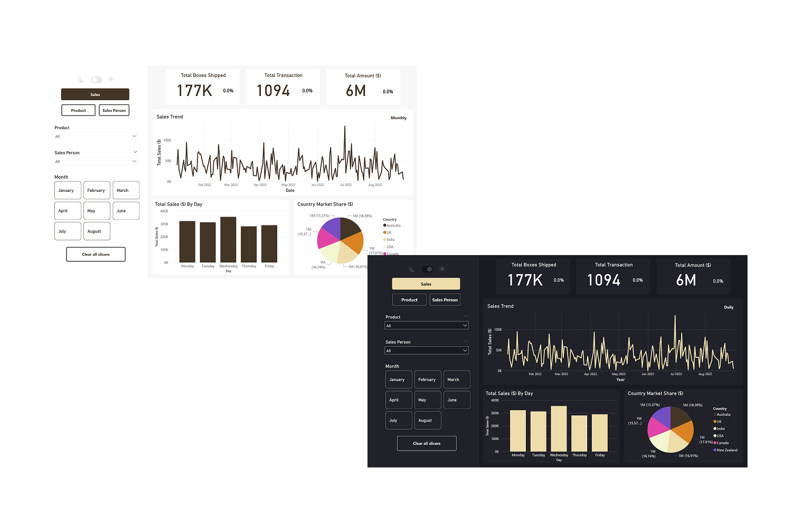

# Chocolate Sales Dashboard (Power BI)

This project is a **Chocolate Sales Dashboard** built using **Microsoft Power BI**. It visualizes key sales performance metrics across multiple countries and product lines to support data-driven decision-making in the chocolate retail industry.

## 📊 Dashboard Overview

The dashboard includes:

- 📈 Sales trend over time
- 🌍 Country market share distribution
- 🍫 Top 5 products by boxes shipped and total sales
- 👥 Sales contributors by boxes shipped or sales value

> 🔍 **Goal**: Provide actionable insights for sales managers and executives to understand product performance, market penetration, and top contributors to revenue.

## 📁 Dataset

The dataset used for this dashboard was sourced from Kaggle.

- Source: [Kaggle Chocolate Sales Dataset](https://www.kaggle.com/datasets/atharvasoundankar/chocolate-sales) *(Insert actual dataset link here)*
- Includes data on product shipments, countries, sales quantities, and revenue over time.

## 🖼️ Screenshot

  
*Replace with your actual image path or URL*

## 🔗 Project Access

You can view or download the Power BI report here:

👉 [View Power BI Report (Google Drive/OneDrive/etc.)](https://app.powerbi.com/view?r=eyJrIjoiOWUzZTI2YTYtNWQ4My00ODUxLWJjYWEtMjRiNzI2OTBjMjNiIiwidCI6IjM0ODViOTYzLTgyYmEtNGE2Zi04MTBmLWI1Y2MyMjZmZjg5OCIsImMiOjEwfQ%3D%3D)

## ⚙️ Tools Used

- **Microsoft Power BI**
- **Excel / CSV** (for initial data cleaning and transformation)
- **Kaggle** (data source)

## 📌 How to Use

1. Download the `.pbix` file from the link above.
2. Open it in Power BI Desktop.
3. Explore and interact with the dashboard to gain insights.

## 📃 License

This project is licensed under the MIT License.  
You are free to use, modify, and distribute it with proper attribution.

---

Feel free to reach out if you'd like to collaborate or discuss improvements!
